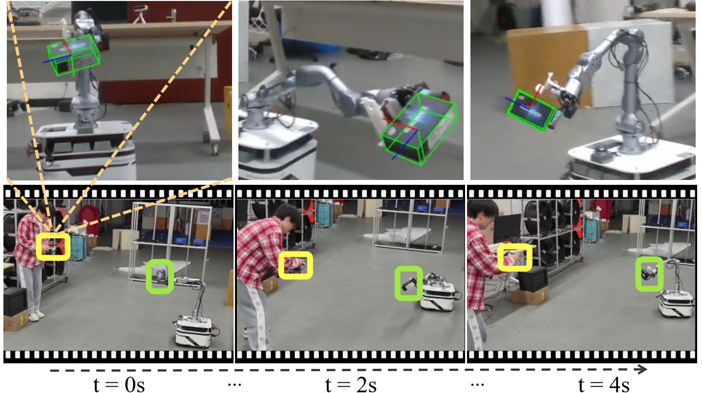
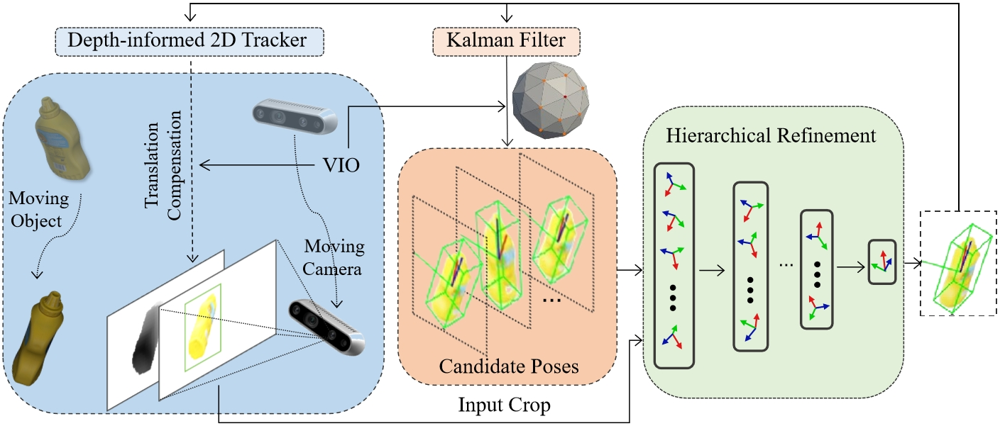

<div align="center">
    <h1> 
      DynamicPose
    </h1>
    </h1>
    <h2>DynamicPose: Real-time and Robust 6D Object Pose Tracking for Fast-Moving Cameras and Objects</h2>
        <p align="center">
        <strong><span style="font-size: 20px;">Accepted to <em>IROS 2025</em> </span></strong>
        </p>
    <br>
        <a href="https://robotics-star.com/people" target="_blank">Tingbang Liang</a><sup>1,2,*</sup>,
        <a href="https://robotics-star.com/people" target="_blank">Yixin Zeng</a><sup>1,*</sup>,
        JiaTong Xie<sup>1</sup>,
        <!-- <a href="https://facultyprofiles.hkust-gz.edu.cn/faculty-personal-page/ZHOU-Jinni/eejinni" target="_blank">Jinni Zhou</a><sup>1</sup>,
        Zhenchao Qi</a><sup>1</sup>, -->
        <!-- <a href="https://personal.hkust-gz.edu.cn/junma/people-page.html" target="_blank">Jun Ma</a><sup>1</sup>, -->
        <a href="https://robotics-star.com/people" target="_blank">Boyu Zhou</a><sup>3,†</sup>
        <p>
        <h45>
            <sup>1</sup> School of Artificial Intelligence, Sun Yat-Sen University, Zhuhai, China. &nbsp;&nbsp;
            <br>
            <sup>2</sup> School of Mechanical Engineering, Xi’an Jiaotong University, Xi’an, China. &nbsp;&nbsp;
            <br>
            <sup>3</sup> Department of Mechanical and Energy Engineering, Southern University of Science and Technology, Shenzhen, China. &nbsp;&nbsp;
            <br>
        </h45>
        <strong>
        <em>
        <sup>*</sup>Equal contribution. Listing order is random    
        <br>
        <sup>†</sup>Corresponding Authors
        </em>
        </strong>
    </p>
    <a href="https://arxiv.org/abs/2508.11950">
      
    </a>
    <a href="http://xhslink.com/a/U3WUSAKxpJTdb">
        
    </a>

<br>

</div>

<!-- {width=900px} -->

<div align="center">
  
</div>

---
## News
- [30/09/2025]: Release part of the code for DynamicPose.
- [16/06/2025]: DynamicPose is accepted to *IROS 2025*
---
## Introduction

**[IROS 2025]** This repository maintains the implementation of "DynamicPose: Real-time and Robust 6D Object Pose Tracking for Fast-Moving Cameras and Objects".

Please kindly star ⭐ this project if it helps you. Thanks for your support! 💖

<div align="center">
  
</div>


---
## Demo

Real-world:

https://github.com/user-attachments/assets/1c821b64-d0db-4fff-8de0-ab1628f2eb4a

Pose Tracking Comparison:

https://github.com/user-attachments/assets/4de948b9-9d42-412a-80cb-8a1b50dcb52b


<!-- ---  -->

<!-- ## Code

<div>
 <h3>
 Coming Soon...
 </h3>
</div> -->

---
## Install
```
conda create -n dynamicpose python=3.9.19
conda activate dynamicpose
conda install pytorch==2.1.0 torchvision==0.16.0 torchaudio==2.1.0 pytorch-cuda=11.8 -c pytorch -c nvidia
pip3 install pycryptodomex 
pip3 install python-gnupg
```


- FoundationPose
  In this step, you should ensure that CUDA_11.8 has been installed.
```
// install eigen 3.4.0 [optional]
cd $HOME && wget -q https://gitlab.com/libeigen/eigen/-/archive/3.4.0/eigen-3.4.0.tar.gz && \
tar -xzf eigen-3.4.0.tar.gz && \
cd eigen-3.4.0 && mkdir build && cd build
cmake .. -Wno-dev -DCMAKE_BUILD_TYPE=Release -DCMAKE_CXX_FLAGS=-std=c++14 ..
sudo make install
cd $HOME && rm -rf eigen-3.4.0 eigen-3.4.0.tar.gz

// use conda to install the Python environment
cd ${YOUR_WORKSPACE_PATH}/src/Dynamic_6D/object_pose_estimator/include/FoundationPose
conda activate dynamicpose
python -m pip install -r requirements.txt
python -m pip install --quiet --no-cache-dir git+https://github.com/NVlabs/nvdiffrast.git
python -m pip install --quiet --no-cache-dir kaolin==0.15.0 -f https://nvidia-kaolin.s3.us-east-2.amazonaws.com/torch-2.1.0_cu118.html
python -m pip install "git+https://github.com/facebookresearch/pytorch3d.git"
CMAKE_PREFIX_PATH=$CONDA_PREFIX/lib/python3.9/site-packages/pybind11/share/cmake/pybind11 bash build_all_conda.sh
```

[1]. Download all network weights from [here](https://drive.google.com/drive/folders/1DFezOAD0oD1BblsXVxqDsl8fj0qzB82i?usp=sharing) and put them under the folder `weights/`. For the refiner, you will need `2023-10-28-18-33-37`. For scorer, you will need `2024-01-11-20-02-45`.

[2]. [Download demo data](https://drive.google.com/drive/folders/1pRyFmxYXmAnpku7nGRioZaKrVJtIsroP?usp=sharing) and extract them under the folder `demo_data/`

right now, you can check if FoundationPose is ready by:
```
conda activate dynamicpose
cd ${YOUR_WORKSPACE_PATH}/src/Dynamic_6D/object_pose_estimator/include/FoundationPose
python run_demo.py
```

- MixFormerV2
```
cd ${YOUR_WORKSPACE_PATH}/src/Dynamic_6D/object_pose_estimator/include/MixFormerV2
conda activate dynamicpose
pip install tensorboardX jpeg4py lmdb easydict transformers empy
python tracking/create_default_local_file.py --workspace_dir . --data_dir ./data --save_dir .
```

- Grounding DINO
```
cd ${YOUR_WORKSPACE_PATH}/src/Dynamic_6D/object_pose_estimator/config/gdino_checkpoints/
conda activate dynamicpose
huggingface-cli download IDEA-Research/grounding-dino-tiny --local-dir grounding-dino-tiny
```

- Potential bug fixes [Optional]
  Using rospy in python=3.9, there are some potential bug:

    1) version of libffi:  
    ```
    libp11-kit.so.0: undefined symbol: ffi_type_pointer, version LIBFFI_BASE_7.0
    ```
    [Solution](https://blog.csdn.net/qq_38606680/article/details/129118491?spm=1001.2014.3001.5506): 
    ```
    BASE_ENV_PATH=$(conda info | grep "base environment" | awk '{print $4}')
    cd $BASE_ENV_PATH/envs/dynamicpose/lib
    mv ./libffi.so.7 ./libffi.so.7.bak
    sudo ln -s /lib/x86_64-linux-gnu/libffi.so.7.1.0 libffi.so.7
    ```

---
## Run Demo
- [Download demo bag](https://pan.baidu.com/s/161YF7J0G94x60W3eEm0hLA?pwd=2299) and extract them under the folder 'demo_bag/'
  
- Run Pose Estimator
  ```
  cd ${YOUR_WORKSPACE_PATH}/
  catkin_make
  roslaunch object_pose_estimator rviz.launch
  roslaunch object_pose_estimator run_demo.launch
  ```

  Execution Example: 
  https://github.com/user-attachments/assets/d5559d35-c16d-479f-84e4-35484f16fa0b

---
## Acknowledge
- https://github.com/NVlabs/FoundationPose
- https://github.com/Gy920/segment-anything-2-real-time
- https://github.com/IDEA-Research/GroundingDINO
- https://github.com/MCG-NJU/MixFormerV2
- https://github.com/teal024/FoundationPose-plus-plus

---
## Maintenance
For any technical issues, please contact:
  * Yixin Zeng(zengyx53@gmail.com)
  * Tingbang Liang(tingbangliang@gmail.com)
---
## Citation
```bibtex
@article{liang2025dynamicpose,
  title={DynamicPose: Real-time and Robust 6D Object Pose Tracking for Fast-Moving Cameras and Objects},
  author={Liang, Tingbang and Zeng, Yixin and Xie, Jiatong and Zhou, Boyu},
  journal={arXiv preprint arXiv:2508.11950},
  year={2025}
}
```